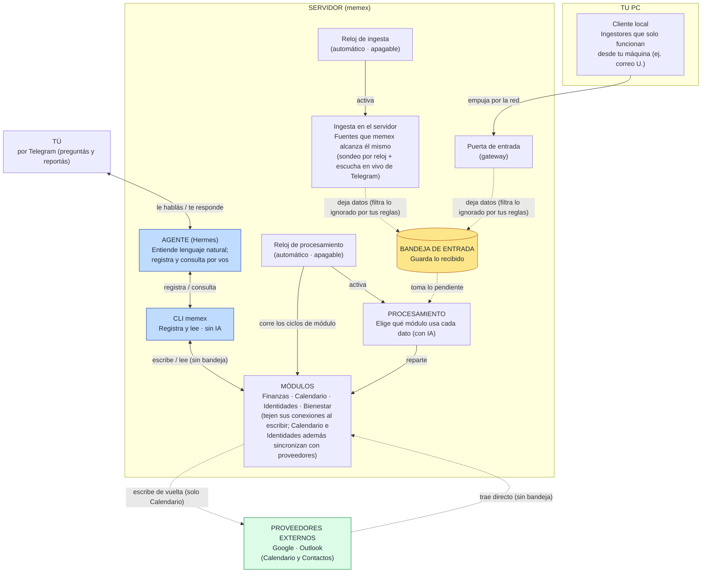

# Arquitectura — vista de control

Cómo **entran** los datos, cómo se **recuperan**, y lo único que **sale**.

- **Entran** por tres vías: *ingesta* (pasiva: correo/Telegram que llegan, pasan por la bandeja),
  *agente* (activa: lo que reportás), y *sync directa con proveedores* (Calendario e Identidades
  jalan de Google/Outlook **sin pasar por la bandeja**).
- **Se recuperan** preguntándole al **agente**, que consulta los módulos por vos y te responde.
- **Sale** una sola cosa: Calendario **escribe de vuelta** a tu proveedor (write-back).

## Cómo leerlo

- **Flecha sólida** = una pieza le pide / manda algo a otra (activar, registrar, consultar, responder).
- **Flecha punteada** = movimiento de datos hacia/desde un almacén o servicio externo
  (la bandeja, o un proveedor como Google/Outlook).
- **Flecha doble (↔)** = ida y vuelta: el agente **escribe y lee** los módulos; vos **preguntás y recibís** respuesta.
- **Recordar = preguntarle al agente.**

## Las piezas (en simple)

- **Tú** — por Telegram: le reportás cosas al agente y le preguntás para recordar.
- **Agente (Hermes)** — el cerebro que entiende lenguaje natural; **corre en el mismo servidor**.
  Registra lo que le decís y **consulta los módulos por vos** para responderte. memex no interpreta:
  guarda, valida, deduplica y conecta.
- **CLI memex** — la única puerta del agente; registra y lee directo en los módulos, sin IA.
- **Proveedores externos (Google / Outlook)** — Calendario e Identidades se sincronizan **directo**
  con ellos: **traen** datos a sus tablas (entran **sin tocar la bandeja**, sin IA) y Calendario los
  **escribe de vuelta** (write-back, el único dato que sale del sistema). Lo dispara el reloj de
  procesamiento, no PROCESAMIENTO.
- **Cliente local (tu PC)** — corre los ingestores que solo funcionan desde tu máquina; empuja por la red.
- **Puerta de entrada (gateway)** — por donde el cliente local mete sus datos; caen en la bandeja.
- **Ingesta en el servidor** — baja las fuentes que memex puede alcanzar él mismo. Casi todo es
  **sondeo** que agenda el reloj, pero algunas fuentes no esperan: Telegram **en vivo** corre como
  un escucha persistente que arranca con el servidor y reacciona al instante; igual cae en la bandeja.
- **Bandeja de entrada** — el buffer que desacopla la ingesta del procesamiento; guarda lo recibido.
  Antes de entrar, cada record pasa por un **filtro**: lo que tus reglas marcan como ruido se descarta.
- **Procesamiento** — toma lo pendiente, decide con IA qué módulo aplica a cada dato y lo reparte.
- **Módulos** — cada uno extrae su dominio y **teje sus conexiones (grafo) al escribir**. Finanzas e
  identidades reciben por las dos vías de ingesta; **bienestar solo por el agente**; **Calendario e
  Identidades además sincronizan con su proveedor externo** (la tercera vía).
- **Los dos relojes** — programas de fondo independientes. El de ingesta agenda el sondeo de fuentes;
  el de procesamiento corre tanto el procesamiento del inbox como los **ciclos de cada módulo**
  (incluida la sync externa). Ambos apagados por defecto.

## Equivalencias con el código (para quien baje a implementar)

| En el diagrama | En el código |
|---|---|
| Agente | Hermes (co-locado en el servidor) — ver `hermes-memex-architecture` |
| CLI memex | `memex` = `agent_cli:main` (dispatch + allowlist + evento multi-hecho `start/end/cancel`) |
| Registrar (escribir) | `register()` de cada dominio — sin LLM, sin inbox |
| Consultar (leer) | `list` / `summary` / `adherence` de cada dominio (CLI) |
| Conexiones (grafo) | `weave_event` / `weave_finance_consolidated` / `weave_afiliacion` dentro del `register`; tablas `relation_edges` + vista `/grafo` |
| Proveedores externos | sync de Calendario (`run_pull` / `run_push`, `calendar/sync.py`) + Identidades (`run_sync`, `identidades/sync.py`) — directo a `mod_calendar_events` / `mod_identidades`, sin inbox; disparado por los jobs `calendar` / `identidades` del scheduler de jobs |
| Escucha en vivo (Telegram) | `StreamingRunner` (lifespan de FastAPI, `api/streaming.py`) — `streaming=True`; arranca con el API, no por reloj |
| Filtro de entrada | `DeterministicFilterMiddleware` (`core/filters.py`) — descarta por reglas del usuario antes de la bandeja, en todas las vías |
| Cliente local | `memex_local_client` (en tu PC) reusando el mismo runner |
| Puerta de entrada | endpoints `/gateway/plugins/{name}/…` + `GatewayClient` (sink por HTTP) |
| Ingesta en el servidor | `run_ingestor` (runner) escribiendo por un *sink* en proceso |
| Bandeja de entrada | tabla `inbox` |
| Procesamiento | orquestador — `run_extraction()` |
| Reloj de ingesta | daemon `memex-ingest-scheduler` |
| Reloj de procesamiento | job `extract` + ciclos `calendar`/`finance`/`identidades` del scheduler de jobs |
