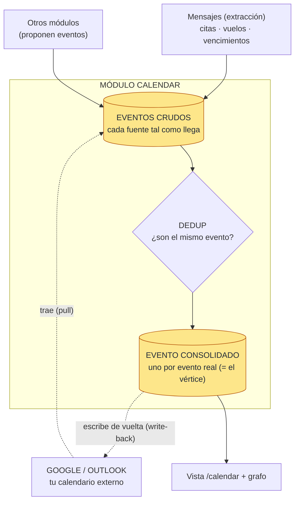
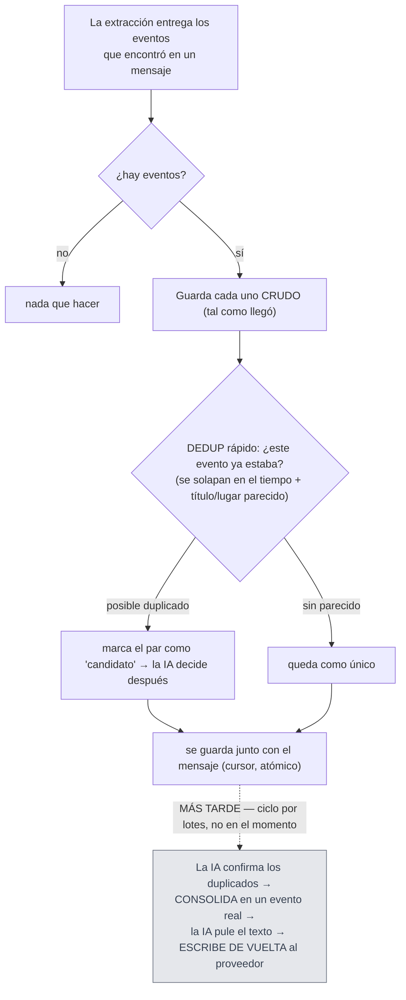

# Módulo eventos (calendario) — arquitectura

> En el código el módulo se llama **`calendar`** (`src/memex/modules/calendar/`). Es el dominio de
> **eventos con fecha** de memex.

Junta tus eventos de **dos mundos** y los deja como un único calendario limpio:
- los que **extrae de tus mensajes** (una cita en un correo, un vuelo, un vencimiento), y
- los que **sincroniza de tu calendario externo** (Google/Outlook).

Y es **bidireccional**: no solo lee tu calendario externo — también **escribe de vuelta** tu vista
consolidada (el único dato que *sale* de memex hacia afuera).

Su problema central es el mismo que finanzas: **el mismo evento llega por varios lados** (el invite por
correo + el evento ya en tu Google). Por eso deduplica y **consolida** en un solo evento real.

## Arquitectura

**De un vistazo:** un evento entra por **tres lados** (mensajes, tu calendario externo, otros
módulos) y todos caen en la **misma tabla de crudos**. El **dedup** decide cuáles son el mismo evento;
la **consolidación** los funde en uno real (el que ves y el nodo del grafo). Con tu calendario externo
la flecha va en **los dos sentidos**: lo trae (*pull*) y le escribe de vuelta (*write-back*).

## Responsabilidades

1. **Extraer eventos de mensajes** — citas, reuniones, clases, exámenes, vuelos, vencimientos. Solo
   eventos reales con fecha concreta (no promos).
2. **Traer tu calendario externo** — sincroniza eventos de Google/Outlook **directo**, sin pasar por
   el pipeline de mensajes.
3. **Aceptar eventos de otros módulos** — un módulo puede proponer eventos (vía implementada, hoy sin
   uso).
4. **Deduplicar** — reconocer cuándo dos avisos son el mismo evento (se **solapan en el tiempo** +
   título o lugar **parecido**). Lo marca conservador; la IA confirma los dudosos.
5. **Consolidar** — fundir los duplicados en **un** evento real, eligiendo un "ganador" por prioridad.
6. **Prioridad y conflictos** — lo **manual** (o de tu calendario) gana; dos eventos importantes que
   **chocan de horario** quedan marcados para que **vos** revises (nunca los fusiona a la fuerza).
7. **Escribir de vuelta (write-back)** — empuja tu vista consolidada de regreso a Google/Outlook (lo
   único que *sale* de memex), sin entrar en bucle.
8. **Servir** — la vista `/calendar`, el grafo (cada evento es un nodo), y responder a otros módulos
   (ej. **geo**: tu próximo evento + su lugar).

## Cómo procesa un evento de la extracción

Cuando el orquestador procesa un mensaje, llama `calendar.persist(...)` con los eventos que el LLM
extrajo. **Importante (igual que finanzas):** por esta vía, `persist` solo **guarda el evento crudo y
lo marca** como posible duplicado. **Confirmar** los duplicados, **consolidar**, pulir el texto y
**escribir de vuelta** pasa **después**, en un ciclo por lotes.

En palabras:
1. **Guarda crudo** cada evento (tal como llegó).
2. **Dedup rápido y conservador**: si se solapa en el tiempo con otro **y** el título o el lugar se
   parecen → marca el par como **candidato** (no decide todavía). Si no, queda **único**.
3. **Guarda y cierra** — todo junto con el mensaje, en una sola transacción (si algo falla, se repite).
4. **Lo demás es después** — el ciclo por lotes: la IA **confirma** los duplicados, la consolidación
   funde los grupos en el evento real, la IA **pule el texto**, y el **write-back** lo manda a tu
   calendario externo.

## Las vías de entrada (y la salida)

| Vía | En simple |
|---|---|
| **Mensajes (extracción)** | Automática, vía LLM. Solo guarda crudo + marca duplicados. Consolida **después**. |
| **Tu calendario externo (pull)** | Trae eventos de Google/Outlook directo a la tabla cruda, sin IA. Los que pusiste a mano allá entran con **prioridad alta**. |
| **Otros módulos (contribute)** | Un módulo que dependa de calendario puede **proponer** eventos. Implementado, hoy sin consumidor. |
| **Write-back (SALIDA)** | No es entrada: empuja la **vista consolidada** de regreso al proveedor (lo único que sale del sistema), con anti-bucle. |

## Precisiones (lo no obvio)

- **La extracción solo deja el evento crudo + lo marca.** Confirmar duplicados, consolidar, pulir y
  escribir de vuelta pasa **después**, en el ciclo por lotes (job `calendar`, cada 30 min, **arranca
  apagado**).
- **Tres fuentes, una sola tabla.** Mensajes, tu calendario externo y otros módulos llenan la misma
  tabla cruda y pasan por el mismo dedup.
- **Consolidar ≠ pulir con IA.** Consolidar (elegir el evento **ganador**) es determinista; la IA solo
  **mejora el texto** (título/lugar/descripción). **La fecha y la hora siempre vienen del ganador**,
  nunca de la IA.
- **Las fechas se guardan SIN zona horaria, a propósito** — porque la IA no resuelve confiablemente la
  zona de "el 14 a las 3PM"; inventar un instante exacto sería falsa precisión.
- **Conflictos → revisión, no fusión.** Dos eventos importantes que chocan de horario se **marcan**
  para que decidas vos; el sistema nunca los une por su cuenta.
- **Todavía no se conecta con otros dominios en el grafo.** Proyecta el nodo "evento", pero aún no
  teje la arista "mismo evento" con finanzas/bienestar (le falta el `event_id` de correlación).

---

## Apéndice técnico

Para quien mantiene el código (`src/memex/modules/calendar/`). Es un `InterestModule` (consume
`EMAIL`+`CHAT`). Mecanismo de unicidad propio (`identity_fields=()`): los crudos coexisten y el vértice
lo materializa la consolidación (ADR-018). Mismo patrón de dos fases que finanzas.

### Equivalencias con el diagrama

| En el diagrama | En el código |
|---|---|
| Guardar crudo (extracción) | `persist`→`dedup` FASE 1 (`module.py`); `mod_calendar_events` `origin='extracción'` |
| Traer tu calendario (pull) | `run_pull` (`sync.py`); `origin='provider'`; idempotente por `etag`/`sync_token`, full-resync ante 410 |
| Eventos de otros módulos | `provide_domain` → `CalendarDomainReader.contribute` (`domain.py`, `origin='module'`) |
| Dedup | FASE 1 `mark_duplicates` (`dedup.py`, determinista, puro) → FASE 2 `run_dedup_phase2` (`dedup_llm.py`, LLM) |
| Consolidar (ganador) | `run_consolidation`: union-find + `pick_winner` (`consolidate.py`); `mod_calendar_consolidated` + `mod_calendar_event_links` (N:1) |
| Pulir texto con IA | `run_merge` (`merge_llm.py`) — estable por firma SHA256; solo texto, fecha/hora del ganador |
| Prioridad / conflictos | `pick_winner` (manual=100, `protected`) + `find_conflicts` (`conflicts.py`) → `mod_calendar_conflicts` (pending review) |
| Write-back (salida) | `run_push` (`sync.py`); echo-suppression por firma + marcador `memex_consolidated_id`; `mod_calendar_writeback` |
| Ciclo por lotes | `run_calendar_cycle` (`scheduler/jobs.py`, job `calendar` PT30M, **arranca apagado**): pull → dedup F2 → consolidación → merge → push |
| Vértice del grafo | `relations/vertices.py` (`mod_calendar_consolidated`, `kind='evento'`, `WHERE NOT deleted`) |
| Cursor | lo escribe el **orquestador** en la misma tx que `persist` |

### Qué guarda (tablas)

Migraciones **0010** (base + decisión fecha/hora NAIVE) y **0011** (sync/consolidación/write-back).

- **`mod_calendar_events`** — eventos **crudos** de las 3 fuentes (`origin`), sin fusión. `starts_on`
  (DATE, ancla obligatoria), `start_time`/`end_time` (TIME, NULL=todo-el-día), `priority_rank`
  (manual=100), `protected`, `provider_event_id` (idempotencia del sync), `processing_outcome`.
- **`mod_calendar_dedup_candidates`** — pares "quizás iguales" (`a<b`, `status`
  candidate/confirmed/rejected, `decided_by` phase1/llm).
- **`mod_calendar_consolidated`** — el **evento real** (el vértice); `winner_event_id`,
  `merge_signature`, `deleted` (tombstone). **El front lee de aquí.**
- **`mod_calendar_event_links`** — qué crudos pertenecen a cada consolidado (N:1).
- **`mod_calendar_conflicts`** — choques de horario de alta importancia, para revisión humana.
- **`mod_calendar_provider_accounts`** · **`mod_calendar_writeback`** — cuentas (cursor `sync_token`,
  `write_back`) y estado del write-back (etag, firma, echo-suppression). El token OAuth vive en una
  env var, no en la DB (ADR-001).
- **`mod_calendar_sync_runs`** · **`mod_calendar_event_changes`** — observabilidad (read-only).

### Archivos clave

| Archivo | Rol |
|---|---|
| `module.py` | `CalendarModule`: contrato, `persist`→`dedup` FASE 1 (insert crudos + marca pares + outcome), superficie de lectura. |
| `schema.py` · `prompt.py` | `CalendarEventItem` (contrato de extracción) y los prompts (extracción + dedup + merge). |
| `dedup.py` · `dedup_llm.py` | FASE 1 determinista (solapamiento + similitud) y FASE 2 LLM. |
| `consolidate.py` · `conflicts.py` | Union-find + `pick_winner` → vértice + links; detección de conflictos de horario. |
| `merge_llm.py` | Enriquecimiento de texto del vértice, estable por firma. |
| `sync.py` | Sync bidireccional: `run_pull` (ingreso) + `run_push` (write-back). |
| `providers/` | `CalendarProvider` (Protocol) + `GoogleCalendarClient` (httpx) + OAuth. |
| `domain.py` · `cli.py` | `CalendarDomainReader` (lectura + `contribute`) y `memex-calendar-sync`. |
| `scheduler/jobs.py` | `run_calendar_cycle` (orquesta el ciclo por lotes). |
| `relations/vertices.py` · `relations/deterministic.py` | Proyección del vértice y co-ocurrencia (no teje `mismo_evento`). |
| `migrations/0010`, `0011` | Esquema base + sync/consolidación/write-back. |
