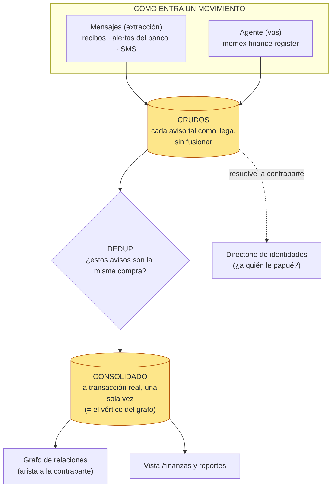
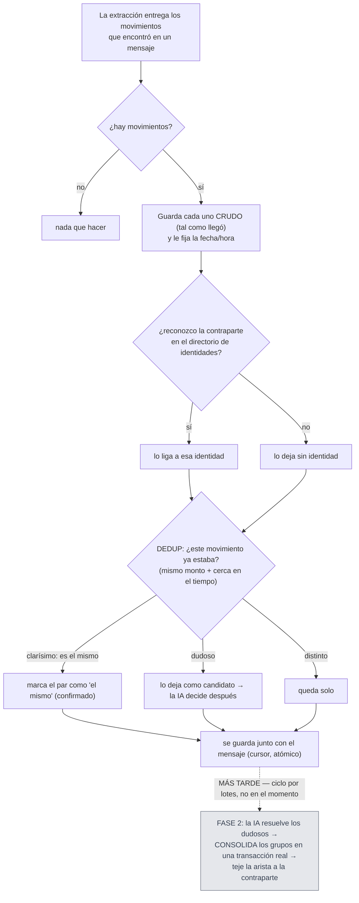

# Módulo finanzas — arquitectura

El **registro de movimientos de plata** de memex: extrae **ingresos y egresos** de tus correos y
chats (recibos, alertas del banco, SMS de la tarjeta) y los deja como un libro contable limpio.

Su problema central, en una frase: **el mismo pago llega varias veces** (el recibo por correo + la
alerta del banco + el SMS de la tarjeta). Si los contara todos, contaría una compra como tres. Por
eso su trabajo más fino es **deduplicar**: darse cuenta de que esos avisos son **la misma compra** y
dejar **una sola** transacción real.

La analogía: un contador que recibe el mismo gasto por tres canales y tiene que reconocer que es **un
solo** asiento, no tres.

## Arquitectura

**De un vistazo:** un movimiento entra por dos lados (mensajes o el agente). Cada aviso se guarda
**crudo** (tal como llegó, sin tocar). El **dedup** decide cuáles avisos son la misma compra, y la
**consolidación** los funde en **una** transacción real — ese consolidado es el dato canónico (lo que
ves en la vista) y el **nodo** del grafo. De paso, la contraparte ("a quién le pagué") se resuelve
contra el **directorio de identidades**.

## Responsabilidades

1. **Extraer movimientos de plata** — ingresos y egresos de correos y chats. Filtra lo que no es real
   (pagos fallidos/cancelados, publicidad) y pide monto, moneda, categoría, contraparte y fecha.
2. **Guardar cada aviso crudo** — sin fusionar; varios avisos del mismo gasto **coexisten**.
3. **Deduplicar** — reconocer cuándo varios avisos son la misma compra (mismo monto + cerca en el
   tiempo + misma contraparte). Lo clarísimo lo marca solo; lo dudoso lo deja para que la IA decida.
4. **Consolidar** — fundir cada grupo de duplicados en **una** transacción real (la "consolidada");
   es el dato que se lee y se reporta.
5. **Multimoneda** — comparar montos en distintas monedas (con tasas aproximadas) para el dedup;
   **nunca** fusiona automáticamente un cruce de monedas.
6. **Saber a quién le pagaste** — resuelve la contraparte (el texto "Uber") contra el directorio de
   identidades. Si dos movimientos tienen contrapartes **distintas**, no pueden ser el mismo.
7. **Alimentar el grafo** — la transacción consolidada es un nodo, conectado a su **contraparte**
   (identidad) y al **evento** que la originó.
8. **Vía del agente** — podés registrar una transacción directo (`memex finance register`), sin IA;
   por esa vía sí consolida y teje todo al instante.

## Cómo procesa un movimiento de la extracción

Cuando el orquestador procesa un mensaje, llama `finance.persist(...)` con los movimientos que el LLM
extrajo. **Importante:** por esta vía, `persist` solo **deja el movimiento en bruto, lo liga a su
contraparte y lo dedupea**. **Consolidar** (fundir duplicados) y **tejer las conexiones** pasa
**después**, en un ciclo por lotes — no en el momento.

En palabras:
1. **Guarda crudo** cada movimiento (tal como llegó) y le fija la mejor fecha/hora que tenga (si no
   hay fecha, usa cuándo llegó el mensaje).
2. **Liga la contraparte** a una identidad del directorio, si la reconoce (si no, la deja sin
   identidad).
3. **Dedupea** contra los movimientos cercanos: **clarísimo** → marca "es el mismo"; **dudoso** →
   candidato para la IA; **distinto** → queda solo.
4. **Guarda y cierra** — todo junto con el mensaje, en una sola transacción (si algo falla, se repite).
5. **Lo demás es después** — la IA desempata los dudosos, la **consolidación** funde los grupos en la
   transacción real y recién ahí se tejen las conexiones del grafo.

## Las vías de entrada

| Vía | En simple |
|---|---|
| **Mensajes (extracción)** | Automática. Solo guarda crudo + liga contraparte + dedupea. **Consolida después**, en el ciclo por lotes. |
| **Agente** (`memex finance register`) | Vos (o Hermes) registrás una transacción directo, sin IA. Acá **sí** consolida y teje las aristas **al instante**, en la misma operación. |
| **Cierre de evento multi-hecho** | Variante del agente: cuando una factura genera varios hechos, ata la contraparte **por id** a la identidad creada en el mismo evento (sin depender del match por nombre). |

## Precisiones (lo no obvio)

- **La extracción solo deja el movimiento en bruto.** Consolidar (fundir duplicados en la transacción
  real) y tejer las conexiones pasa **después**, en el ciclo por lotes — no al procesar el mensaje.
- **La vía del agente sí hace todo al instante** (consolida + teje en la misma operación).
- **Dos contrapartes distintas impiden la fusión** — aunque coincidan monto y hora, si sabemos que
  son personas/orgs distintas, no son el mismo movimiento.
- **Los cruces de moneda nunca se auto-confirman** — si los montos están en monedas distintas,
  siempre van a revisión (IA), nunca automático.
- **El monto se guarda tal cual** (sin convertir); la conversión solo se usa para **comparar** en el
  dedup.

---

## Apéndice técnico

Para quien mantiene el código. Vive en `src/memex/modules/finance/`. Es un `InterestModule` (consume
`EMAIL`+`CHAT`, excluye `SOCIAL`); calca el patrón de calendar (cruda → dedup FASE 1 procedimental →
FASE 2 LLM → consolidación).

### Equivalencias con el diagrama

| En el diagrama | En el código |
|---|---|
| Guardar crudo | `FinanceModule.persist` → `dedup` → `_insert_transactions` (`module.py`); `mod_finance_transactions` (append-only, sin UNIQUE; `identity_fields=()`) |
| Ligar contraparte | `_resolve_identity` vía `ctx.deps['identidades']` (`optional_deps`, dependencia blanda); FK `counterparty_identity_id` |
| Dedup (¿es el mismo?) | `dedup.py`: `mark_duplicates` → `_gate` (monto+proximidad) + `_evaluate_pair` (score) → 3 bandas; `mod_finance_dedup_candidates` |
| Veto por contraparte distinta | `_same_responsible` — ids distintas → `_evaluate_pair` devuelve `None` y veta el par |
| Multimoneda | `fx.py` (`DEFAULT_RATES`, tolerancia `0.12`); un cruce de monedas nunca cumple `_both_timed` → nunca auto-confirma |
| Consolidar → transacción real | `consolidate.py`: `build_groups` (union-find) + `pick_winner`/`merge_fields`; `mod_finance_consolidated` (el vértice) + `mod_finance_transaction_links` (N:1) |
| La IA desempata dudosos | `dedup_llm.run_finance_dedup_phase2` (FASE 2), en el ciclo |
| Aristas del grafo | `weave_finance_consolidated` (`relations/deterministic.py`): «contraparte» (finance→identidad) + «mismo_evento» (por `event_id`) |
| Ciclo por lotes | `run_finance_cycle` = dedup FASE 2 (LLM) → `run_consolidation` (`scheduler/jobs.py`) |
| Vía agente (inline) | `finance.register` / `memex finance register` (`cli.py`): insert + dedup + `ensure_consolidated` + weave en la misma tx |
| Cursor | lo escribe el **orquestador** (`_insert_cursor`) en la misma tx que `persist` |

### Qué guarda (tablas)

Migración **0036** (v2, reemplazó el viejo `mod_finance_expenses` solo-gastos); **0040** agregó
`event_id`.

- **`mod_finance_transactions`** — los movimientos **crudos** (append-only, **sin UNIQUE**).
  `direction` (ingreso/egreso), `amount`/`currency`, `category`, `counterparty` +
  `counterparty_identity_id`, `occurred_at` + precisión (`datetime`/`date`/`inferred`),
  `processing_outcome`, `event_id` (solo por la vía agente).
- **`mod_finance_dedup_candidates`** — los pares "quizás iguales" (`a<b`, `score`, `status`
  candidate/confirmed/rejected, `decided_by` procedural/llm).
- **`mod_finance_consolidated`** — la **transacción real** (el vértice del grafo); `winner_transaction_id`,
  `deleted` (tombstone). **El front lee de aquí.**
- **`mod_finance_transaction_links`** — qué crudas pertenecen a cada consolidado (N:1).

Costura: `counterparty_identity_id → mod_identidades(id) ON DELETE SET NULL`.

### Archivos clave

| Archivo | Rol |
|---|---|
| `module.py` | `FinanceModule`: contrato, `persist`→`dedup` (insert cruda + ligar identidad + dedup FASE 1), superficie de lectura, y `register` (vía agente: insert + dedup + consolida + teje inline). |
| `schema.py` · `prompt.py` | `TransactionItem` (contrato de extracción) y los prompts (extracción + dedup FASE 2). |
| `dedup.py` | FASE 1 pura: `_gate`, `_same_responsible` (veto de identidad), `_evaluate_pair` (score), `mark_duplicates` (3 bandas). |
| `fx.py` | Multimoneda: tasas, tolerancia, `convert`/`approx_equal`. |
| `consolidate.py` | Union-find → ganador → `mod_finance_consolidated` + links; `run_consolidation` (lote) y `ensure_consolidated` (inline). |
| `dedup_llm.py` | FASE 2: desambigua con LLM los pares "candidate". |
| `cli.py` | `memex-finance`: `register` (agente, sin LLM) / `dedup` / `consolidate`; `register_from_args` (reusado por el cierre de evento). |
| `relations/deterministic.py` · `relations/vertices.py` | Tejido de aristas (contraparte/mismo_evento) y proyección del vértice `finance`. |
| `scheduler/jobs.py` · `agent_event.py` | `run_finance_cycle` (lote) y el cierre de evento (ata contraparte por id). |
| `migrations/0036`, `0040` | Schema v2 (4 tablas) + `event_id`. |
