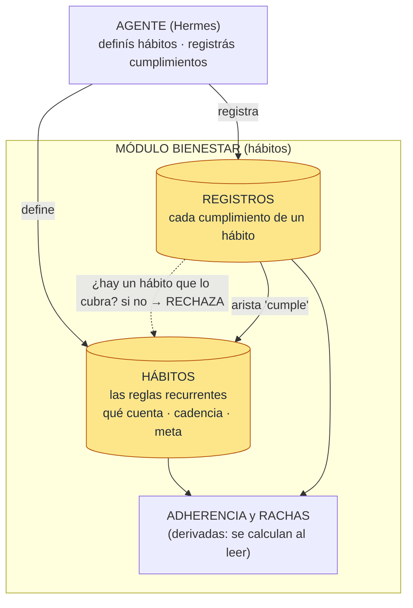
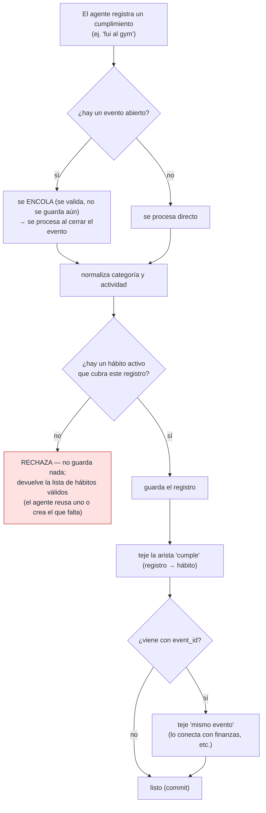

# Módulo hábitos (bienestar) — arquitectura

> En el código el módulo se llama **`bienestar`** (`src/memex/modules/bienestar/`).

Es el módulo de **hábitos**: modela la **adherencia a compromisos recurrentes**. **No es un diario**
de "lo que hice" — distingue dos cosas:

- **HÁBITO** — la **regla recurrente** que vos definís: qué cuenta (una actividad o una categoría),
  con qué **cadencia** (diaria/semanal) y la **meta** (cuántas veces).
- **REGISTRO** — una **instancia de cumplir** ese hábito ("fui al gym hoy").

Lo maneja el **agente** (Hermes): vos le hablás por Telegram y él llama a memex con los campos ya
estructurados. memex es **determinista** — no usa IA ni lee tus mensajes; solo guarda, valida y
reporta.

La pieza que define su naturaleza: al registrar, si **ningún hábito activo cubre** ese registro, lo
**rechaza** (no guarda nada) y te devuelve la lista de hábitos válidos. Por eso es un módulo de
hábitos y no un log libre: **no hay registros huérfanos**.

## Arquitectura

**De un vistazo:** el agente **define hábitos** (las reglas) y **registra cumplimientos**. Cada
registro se valida contra los hábitos: si ninguno lo cubre, **se rechaza**. La relación "cumple"
conecta cada registro con su hábito (en el grafo). La **adherencia y las rachas** no se guardan: se
**calculan al leer**, contando los registros contra cada hábito.

## Responsabilidades

1. **Definir hábitos** — las reglas recurrentes: qué cuenta (una actividad, o una categoría), cada
   cuánto (diario/semanal) y la meta (cuántas veces por período).
2. **Registrar cumplimientos — con rechazo estricto** — cada registro es "cumplí tal hábito". Si
   ningún hábito activo lo cubre, **lo rechaza** (no guarda nada) y devuelve los hábitos válidos, para
   que el agente reuse uno o cree el que falta.
3. **Calcular adherencia y rachas** — cuántas veces cumpliste cada hábito por período y tu racha (con
   **gracia** del período en curso). Se calcula **al leer**, nunca se persiste.
4. **Conectar al grafo** — teje la relación **"cumple"** (registro → hábito); y si el registro vino en
   un evento, lo conecta con los otros hechos (ej. una compra de finanzas).
5. **Servir consultas** — el agente lee los números (lista / resumen / adherencia) para responderte;
   el dashboard muestra los hábitos y permite crearlos/borrarlos.

## Cómo procesa un registro (vía agente)

A diferencia de finanzas o eventos, bienestar **no se llama desde la extracción** — lo dispara el
**agente** al registrar. El paso clave es el chequeo contra los hábitos **antes** de guardar.

En palabras:
1. **Encolar o directo** — si hay un evento multi-hecho abierto, el registro se **encola** (se valida,
   no se guarda) y se procesa al cerrar el evento, junto con los otros hechos. Si no, se procesa directo.
2. **Normalizar** — la categoría (a una lista cerrada; lo que no encaja cae en "otros") y la actividad.
3. **Chequear el hábito** — busca un hábito activo que cubra el registro (por actividad o categoría).
   **Si ninguno → rechaza, sin guardar nada**, y devuelve la lista de hábitos válidos.
4. **Guardar** — inserta el registro (sin deduplicar: dos iguales son dos cumplimientos).
5. **Tejer las relaciones** — la arista "cumple" (registro → hábito) y, si trae `event_id`, "mismo
   evento" (cross-módulo). Todo en la misma transacción.

## Las vías de entrada

| Vía | En simple |
|---|---|
| **Agente por CLI** | La vía principal de escritura: `memex bienestar register` / `habit add`. Campos ya estructurados, sin IA. Si no hay hábito que cubra, devuelve `no_matching_habit` + la lista. |
| **Evento multi-hecho** | Si hay un evento abierto, el registro se encola y se procesa al cerrar (`memex end`), en una sola transacción con los otros hechos; ahí se teje "mismo evento". |
| **Dashboard** | Lee los registros (solo lectura) y **gestiona los hábitos** (crear/borrar). La adherencia se calcula al vuelo. |

## Precisiones (lo no obvio)

- **No es un diario libre.** Solo registra cumplimientos de hábitos que definiste; sin hábito que
  cubra, **rechaza**. No quedan registros huérfanos.
- **La adherencia no se guarda** — se recalcula cada vez que la pedís (contando registros por período).
  No busques una tabla de rachas.
- **Sin IA y sin mensajes** — no extrae de correos; el agente le pasa los campos ya estructurados. Es
  determinista.
- **Sin deduplicación** — dos registros iguales son dos cumplimientos distintos (dos veces al gym = dos
  filas).
- **La categoría fuera de lista se rescata a "otros"** (no rechaza); lo que rechaza es la **falta de un
  hábito** que cubra.

---

## Apéndice técnico

Para quien mantiene el código (`src/memex/modules/bienestar/`). **No** es un `InterestModule` de
extracción (no consume mensajes, no usa LLM). Registrador determinista, dirigido por el agente.

### Equivalencias con el diagrama

| En el diagrama | En el código |
|---|---|
| Definir hábito | `add_habit`/`list_habits`/`delete_habit` (`habits.py`); `mod_bienestar_habits` |
| Registrar cumplimiento | `register` (`module.py`); `mod_bienestar_registros` |
| Rechazo estricto | `_require_matching_habit` → `NoMatchingHabitError` **antes** del INSERT (`module.py`) |
| Match registro↔hábito | `NORM(activity)` o `category` — **misma expresión copiada en 3 lugares** (`module.py`, `habits.py`, `deterministic.py`) para evitar ciclo de import |
| Adherencia / rachas | `adherence` / `_period_counts` / `_streak` (`habits.py`) — derivado, **no persistido** |
| Arista «cumple» | `weave_cumple` → `_materialize_cumple` (`deterministic.py`); registro → hábito, `producer=bienestar`, `confirmed` |
| Arista «mismo_evento» | `weave_event` (cross-módulo con finanzas por `event_id`) |
| Vértices del grafo | `relations/vertices.py`: `bienestar` (registro) + `bienestar:habito` (hábito activo) |
| Entrada del agente | `memex bienestar …` (`agent_cli.py` → `cli.py`); evento multi-hecho (`agent_event.py`) |
| Dashboard | `api/routers/bienestar.py` (registros read-only + CRUD de hábitos) |

### Qué guarda (tablas)

- **`mod_bienestar_habits`** (mig **0039**) — los **hábitos** (la regla): `name`, `activity` **o**
  `category` (la clave de match — CHECK exige al menos una), `cadence` (daily|weekly), `target_count`
  (≥1), `active`.
- **`mod_bienestar_registros`** (mig **0038**) — los **cumplimientos**: `category` (lista cerrada
  comida|higiene|ejercicio|grooming|salud|otros), `activity`, `occurred_at` + precisión,
  `detail`/`metadata` (JSONB), `event_id`. **Sin dedup**, sin atribución a inbox.
- **Aristas en `relation_edges`** — «cumple» (registro → hábito) y «mismo_evento» (cross-módulo).
- **Adherencia / rachas** — **no se guardan**: cálculo en lectura.

### Archivos clave

| Archivo | Rol |
|---|---|
| `module.py` | Núcleo de registros: `register` (con `_require_matching_habit` + tejido de aristas), `list_registros`, `summary`, `NoMatchingHabitError`. Guardián de la invariante. |
| `habits.py` | Hábitos + adherencia derivada: `add_habit`/`list`/`delete` + `adherence`/`_streak` (racha con gracia). |
| `schema.py` | Categorías cerradas + `normalize_category` (fuera → "otros") / `normalize_activity`. |
| `cli.py` | CLI `memex-bienestar` (register/list/summary/habit/adherence) + `register_from_args` (reusado por el cierre de evento). |
| `agent_cli.py` · `agent_event.py` | Router del agente (`memex`) + el evento multi-hecho (staging y cierre en orden de dependencia). |
| `relations/deterministic.py` · `relations/vertices.py` | Aristas «cumple»/«mismo_evento» y proyección de los vértices. |
| `api/routers/bienestar.py` | REST: registros read-only + CRUD de hábitos (dashboard). |
| `migrations/0038`, `0039` | Tablas de registros y de hábitos. |
