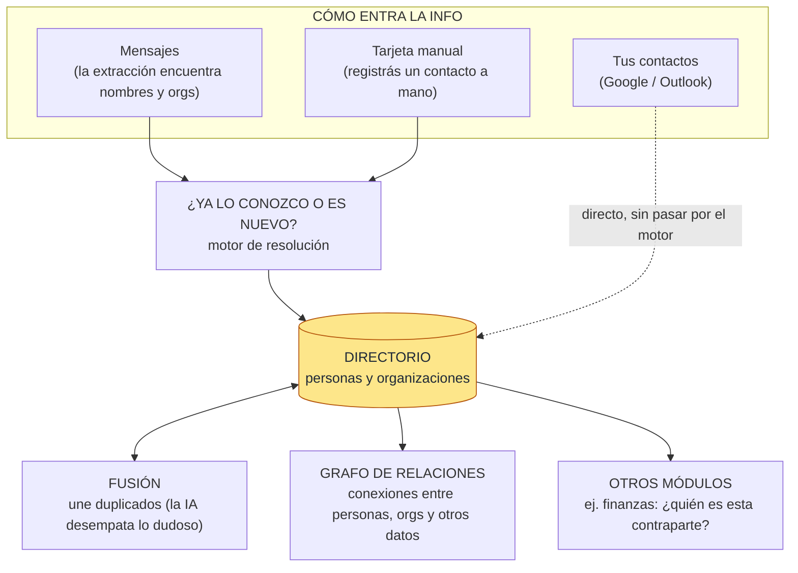
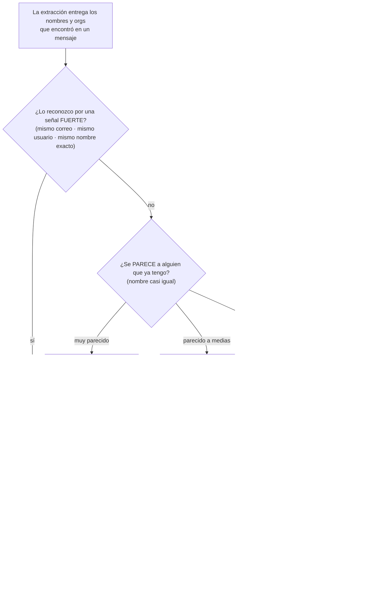

# Módulo identidades — arquitectura

El **directorio inteligente de personas y organizaciones** de memex: una agenda de contactos que se
arma sola a partir de lo que aparece en tus mensajes, más lo que sincronizás de Google/Outlook.

Su trabajo central, en una frase: cuando algo menciona a una persona u organización, **decidir si ya
la conocemos o es nueva** — y evitar tener la misma cosa dos veces.

## Arquitectura

**De un vistazo:** la info entra por tres lados (mensajes, tarjeta manual, tus contactos). Los dos
primeros pasan por el **motor** que decide "¿conocido o nuevo?"; los contactos entran **directo**. El
resultado vive en el **directorio**, que una rutina de **fusión** mantiene limpio de duplicados. Y el
directorio **sirve a dos clientes**: el grafo de relaciones y otros módulos que preguntan "¿quién es
este?".

## Responsabilidades

1. **Reconocer quién es quién** — cuando un mensaje menciona a una persona u organización, decide si
   ya está en el directorio o es alguien nuevo.
2. **No duplicar** — si algo se parece mucho a algo que ya existe, lo une; lo dudoso lo deja en cola
   para que la IA lo resuelva después.
3. **Guardar las señas** — correos, teléfonos, usuarios de redes, dominios: las marcas que identifican
   a cada quien.
4. **Conectar personas con organizaciones** — afiliación ("X está en Y") y jerarquía ("esta org
   pertenece a aquella").
5. **Traer tus contactos** — sincroniza directo desde Google/Outlook, sin pasar por el resto del
   sistema.
6. **Dejar rastro** — cada avistamiento queda como evidencia ligada al mensaje de donde salió.
7. **Servir a los demás** — le responde a otros módulos "¿quién es esta contraparte?" (ej. finanzas) y
   alimenta el grafo de relaciones.

## Cómo decide: ¿ya lo conozco o es nuevo?

Es el corazón del módulo. Decide **en capas**, de lo más seguro a lo más dudoso — como un
bibliotecario que primero busca por el número de carné (infalible) y solo si no lo encuentra compara
nombres parecidos.

En palabras:
1. **Señal fuerte primero.** Si la mención trae un correo, un usuario de red o un nombre exacto que ya
   tenemos → es esa persona, sin dudar. (El remitente del mensaje **no** cuenta como pista para
   terceros, y los `noreply@`/`notifications@` se ignoran.)
2. **Si no, parecido por nombre.** Compara contra los que ya existen: **muy parecido** → es el mismo;
   **parecido a medias** → crea uno nuevo pero lo marca como "dudoso" para revisar; **nada que ver** →
   nuevo.
3. **Siempre deja rastro.** Pase lo que pase, guarda el avistamiento ligado al mensaje.
4. **Lo dudoso y las conexiones se resuelven después** — no en el momento (ver Precisiones).

## Las tres vías de entrada

| Vía | En simple |
|---|---|
| **Mensajes (extracción)** | La principal y automática. La extracción saca nombres/orgs de cada mensaje; el motor decide conocido-vs-nuevo y guarda el avistamiento. |
| **Tarjeta manual** | Vos registrás un contacto a mano (`memex identidad add`). Usa el mismo motor, pero no es "un avistamiento en un mensaje". Es la única vía por la que entra el teléfono. |
| **Tus contactos (Google/Outlook)** | Trae tu agenda directo al directorio, **sin** pasar por el motor ni la IA. |

## Precisiones (lo no obvio)

- **Reconocer ≠ conectar.** Al procesar un mensaje, el módulo solo decide quién es quién y lo guarda.
  Las **conexiones del grafo** (afiliación, pertenencia, co-ocurrencia) se tejen **aparte**, después.
- **Lo dudoso no se decide en caliente.** Cuando dos cosas se parecen "a medias", no se arriesga: las
  deja en una cola y **la IA las desempata más tarde**, con sesgo a mantenerlas separadas si no está
  segura.
- **Tus contactos entran sin IA.** La sincronización con Google/Outlook escribe directo; no gasta
  motor ni LLM.
- **El teléfono solo entra por tarjeta manual** — no se extrae de los mensajes.

---

## Apéndice técnico

Para quien mantiene el código. Vive en `src/memex/modules/identidades/`. Es un `InterestModule`
(consume `EMAIL`/`CHAT`/`SOCIAL`); resuelve con un mecanismo propio (señales fuertes en O(1) +
trigramas `pg_trgm`), sin LLM en línea.

### Equivalencias con el diagrama

| En el diagrama | En el código |
|---|---|
| Motor de resolución (señal fuerte) | `KnownIndex.resolve` — cascada email → dominio→org → handle → nombre → alias (`resolve.py`) |
| Parecido por nombre | `find_fuzzy_candidates` (`pg_trgm`) + umbrales `HIGH=0.92` / `LOW=0.55` (`fuzzy.py`) |
| Reconocer al procesar un mensaje | `IdentidadesModule.persist` → `dedup` (`module.py:97`) |
| Avistamiento (rastro) | fila en `mod_identidades_mentions` |
| Cola de dudosos | `mod_identidades_merge_candidates` |
| La IA desempata | `run_merge_phase2` + `disambiguate_pair` (`dedup_llm.py`), en el ciclo del scheduler |
| Fusión | `merge_identities` (`merge.py`) — cascada completa + auditoría |
| Tarjeta manual | `register_card` (`memex identidad add`) |
| Tus contactos | `run_sync` + `GooglePeopleClient` (`sync.py`, `providers/`) |
| Conexiones del grafo | `_materialize_afiliacion`/`_pertenencia`/`_cooccurrence` + `weave_afiliacion` (`relations/deterministic.py`); overflow por `run_cooccurrence_llm` |
| Servir a otros módulos | `provide_domain` → `IdentidadesDomainReader` (`domain.py`), vía `ctx.deps['identidades']` |
| Avance del cursor | lo hace el **orquestador** (`_insert_cursor`) en la misma tx que `persist` |

### Qué guarda (tablas)

Identidad **unificada** con discriminador `kind` (`persona|organizacion`) — migración **0033**
(reemplazó las tablas separadas de 0029):

- `mod_identidades` — el directorio. Columnas generadas para match: `name_norm`, `org_core`.
  `parent_identity_id` = jerarquía (mig **0035**).
- `mod_identidades_identifiers` — correos/teléfonos/handles/dominios por-fuente.
- `mod_identidades_person_orgs` — afiliación persona↔org.
- `mod_identidades_mentions` — los avistamientos (evidencia + a quién se resolvió).
- `mod_identidades_merge_candidates` — la cola del desempate LLM.
- `mod_identidades_sites` — sedes de orgs. · `_provider_accounts`/`_sync_runs` — cursor y stats del sync.

Costura con finanzas: `mod_finance_*` referencian `mod_identidades(id)` por `counterparty_identity_id`.

### Archivos clave

| Archivo | Rol |
|---|---|
| `module.py` | Clase `IdentidadesModule`: contrato, `persist`→`dedup`, creación/alias/candidato, menciones, superficie pública y alta manual. |
| `resolve.py` | Motor determinista: `KnownIndex` + cascada de señales fuertes. |
| `fuzzy.py` | Dedup difuso (`pg_trgm` + levenshtein) + umbrales. |
| `normalize.py` | Normalización espejo del SQL (`normalize_match`, `org_core`, `norm_identifier`, `is_role_email`). |
| `schema.py` · `prompt.py` | El contrato de extracción (`IdentityItem`) y el prompt del LLM. |
| `merge.py` · `dedup_llm.py` | Fusión atómica y el desempate LLM (FASE 2). |
| `hierarchy.py` · `relations_llm.py` | Jerarquía (`run_organize`) y co-ocurrencia overflow. |
| `domain.py` | `IdentidadesDomainReader` para módulos dependientes. |
| `sync.py` · `providers/` | Sync de proveedores + cliente Google People + OAuth. |
| `relations/deterministic.py` · `relations/vertices.py` | Tejido de aristas y proyección de vértices. |
| `scheduler/jobs.py` | `run_identidades_cycle`: `sync → merge → organize → co-ocurrencia`. |
| `migrations/0033`, `0035` | Schema unificado + jerarquía. |
