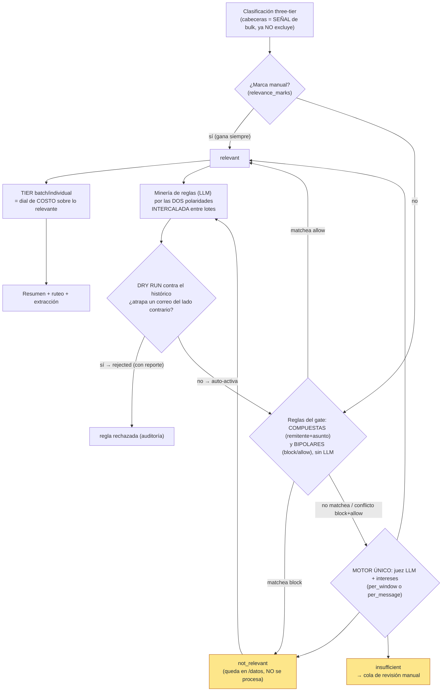

# Sistema de relevancia — arquitectura

**UN solo sistema** decide «qué procesar» en el pipeline de correos. Antes había **tres mecanismos
solapados** (el clasificador de tiers que excluía `blacklist` con solo cabeceras; el gate de
relevancia que accionaba; y la «calidad por remitente» que solo medía y tenía un **segundo** juez
LLM). El rediseño los colapsó: la relevancia es el **filtro primario**, el filtro barato del frente
lo **construye la IA** (minería de reglas), la medición ex-calidad es la **capa de señales** que
alimenta al decisor, y hay **un solo motor de juicio** (un juez LLM + la MISMA lista de intereses)
usado tanto al frente como en la re-evaluación. El tier queda solo como **dial de costo**.

> Esto **enmienda el ADR-020** (los ADR no son inmutables). Migración del esquema:
> `0071_unify_relevance` (sistema unificado) + `0072_relevance_composite_rules` (reglas COMPUESTAS
> remitente+asunto y BIPOLARES block/allow — ver «Reglas del gate» abajo).

Su motivación, en una frase: el router de extracción descartaba promos «porque son publicidad» con
varianza entre corridas (experimento 2026-06-12: 3 de 8 wishlists idénticos de Steam pasaron) —
pero hay publicidad que al dueño **SÍ** le importa. Los intereses son la lista de rescate; y «ser
masivo» (blacklist) no dice nada sobre relevancia, es **solo una señal más**, no un pre-filtro.

La analogía: un asistente que abre tu correo sabiendo qué te importa, tira los panfletos, te deja
lo importante sobre el escritorio y pone aparte lo que no sabe dónde va — y **aprende**: cuando ve
que siempre tira cierto tipo de correo del mismo remitente, escribe una regla para que ni llegue al
escritorio; y cuando ve que siempre te sirve otro tipo del mismo remitente, escribe una regla para
que entre directo sin revisarlo.

## Reglas del gate (compuestas + bipolares)

Una regla es **COMPUESTA** (un remitente Y/O un patrón del asunto, combinados con AND) y tiene una
**POLARIDAD** `effect`:

- `block`: matchea → veredicto `not_relevant` (el correo NO pasa, sin juez ni revisión).
- `allow`: matchea → veredicto `relevant` (el correo ENTRA sin pasar por el juez).

Ambas son **cortocircuitos deterministas que saltan el juez y la cola manual**; la diferencia es el
veredicto. Predicados (al menos uno): remitente (`sender_kind` ∈ `sender_email`/`sender_domain`/
`list_id` + `sender_value`) y/o `subject_pattern` (substring del asunto, case-insensitive). El
remitente solo es **demasiado grueso** (a veces relevante, a veces no): el patrón del asunto
desambigua, así que las reglas **mineadas por el LLM llevan siempre los dos**. La creación manual
admite un solo predicado (bloquear/permitir un remitente entero). **Precedencia**: marca manual >
regla > juez. Un correo que matchea reglas de **ambas** polaridades es un **conflicto**: no se
cortocircuita, cae al juez (y se loguea).

## Arquitectura

**Por LOTE** (incremental, de los más viejos hacia adelante, la pipeline espera a que termine uno
antes del siguiente): classify → relevancia → tier → extract. **Entre lotes** corre la minería de
las DOS polaridades (si el gate está ON + `mining_interleave`): destila reglas a partir de los
`not_relevant` (→ block) y de los `relevant` + rescates manuales (→ allow) acumulados, las valida
con dry run y las auto-activa → el lote siguiente cortocircuita esa clase **gratis** (comparación de
strings, sin LLM). NO es «juzgar 750 y después minar».

El ciclo de automejora es cerrado y seguro: toda regla propuesta —por el LLM o a mano— pasa un
**dry run determinista contra TODO el histórico**; una `block` que atraparía un solo correo de
relevancia efectiva TRUE (o una `allow`, uno FALSE) queda `rejected` con su reporte persistido. Si
pasa, se auto-activa, auditada y reversible. La **precisión la da el patrón** del asunto, no una
tolerancia de ratio: la regla compuesta carva el subconjunto exacto. El LLM puede declararse «datos
insuficientes» (no propone) si no ve un patrón claro. La minería solo analiza remitentes con
`mining_min_messages`+ correos del mismo veredicto acumulados (default **3**, el disparador por
cantidad — configurable); bajo el umbral, corrida no-op **sin llamada LLM**.

## Capa de SEÑALES (procedimientos → candidatos → motor único)

La medición ex-«calidad» dejó de tener su propio juez. Ahora son **procedimientos deterministas
enchufables** (`relevance/procedures.py`) que arman la lista de **candidatos a (re)evaluar**; el
motor único los evalúa (`reevaluate_candidate` → `run_relevance_gate(force=True)`), **no** un
segundo prompt.

- **Señales por remitente** (`relevance/signals.py`, SQL puro): por cada remitente cuenta mensajes,
  cuántos produjeron un **hecho de dominio** (`module_extractions` de un módulo ≠ identidades con
  `item_count>0`), cuántos **solo se resumieron** y cuántos quedaron **inertes**; la marca manual
  (`relevance_marks`) es un override duro por-mensaje (`COALESCE(is_relevant, hecho)`). Ruido primero.
- **Procedimiento `fact_count`** (el primero): remitentes EMAIL con volumen y poca relevancia
  (procesados pero **sin hecho**), aún no accionados (sin override de tier). «Sin hecho» ≠ «sin
  valor»: NO se corta solo, cae a la cola para que el motor único lo re-evalúe contra los intereses
  o el humano confirme. Sumar otro procedimiento (volumen, %relevancia, solo-resumen, señal de
  bulk) = una clase + una entrada en `CANDIDATE_PROCEDURES`; el motor no cambia.
- **Category-agnostic**: cada candidato declara su `unit_type` (correo = `sender`; a futuro
  `topic`/`group`/`post_class`). Solo correo está implementado.

Desde la cola: **re-evaluar** (motor único sobre la muestra), **confirmar ruido → bloquear** (regla
`block` por remitente, con su dry run) o **sacar de la cola** (dismiss).

## Dos lazos de feedback (proponen → el dueño acepta o ajusta; nunca auto-aplican sin auditoría)

- **Juez LLM → reglas (las DOS polaridades)** (`relevance/mining.py`): un solo motor parametrizado
  por `effect`. Sobre los `not_relevant` del juez propone reglas `block`; sobre los `relevant` del
  juez **+ los rescates manuales** (`relevance_marks` TRUE) propone reglas `allow` (entran sin
  juez). Reglas compuestas (remitente + asunto), disparador por cantidad, dry run → auto-activa. Ya
  descrito arriba. El job del scheduler y el intercalado entre ventanas corren `run_rule_mining_cycle`
  (las dos polaridades en una corrida).
- **Rechazo MANUAL → sugerir intereses** (`relevance/interest_mining.py`): agrega las marcas
  manuales (rescates TRUE → `add`; FALSE que matchea un interés activo → `remove`/afinar), umbral
  `interest_suggest_min_marks`, **una** llamada LLM con la MISMA lista de intereses → persiste en
  `interest_suggestions` (`proposed`). **Sin dry-run, sin auto-apply** (los intereses son contexto
  difuso, no matchers): aceptar `add` → `create_interest`; `remove` → pausar el interés. Distinto de
  las reglas `allow`: los intereses **inclinan al juez** (el LLM igual corre); una regla `allow`
  **salta** al juez.

## Decisiones de diseño (y por qué)

- **`blacklist` deja de ser pre-filtro.** «Ser masivo no dice nada sobre la relevancia.» El juez
  ahora ve el bulk; el tier (batch/individual) queda solo como dial de costo sobre lo relevante.
  Cost-safe en OFF: `workset_tier_clause` con el gate APAGADO mantiene la exclusión por cabeceras
  (idéntico a antes); con el gate ENCENDIDO no excluye por tier (gatea la relevancia efectiva). El
  bulk rescatado se procesa como `batch` barato (normalización `blacklist→batch` en los worksets,
  por la trampa de `plan_windows`).
- **Regla compuesta, no solo-remitente.** Un remitente puede ser a veces relevante y a veces no; el
  patrón del asunto delimita el subconjunto. Por eso las reglas mineadas exigen los dos predicados y
  el dry run es estricto (cero contaminación) — la precisión sale del patrón, no de aflojar el umbral.
- **UN solo motor de juicio.** El juez advisory del ex-`quality` (`judge_llm.py`, consumer
  `quality_judge`, columna `llm_verdict`, endpoint `/candidates/judge`) se **borró**. La
  re-evaluación corre el MISMO `run_relevance_gate`.
- **Automejora acotada al gate, NO a la extracción** (ADR-015): nace como sistema APARTE y PREVIO
  al pipeline; los prompts de extracción y los `interest` de los módulos no se tocan.
- **Solo correos** (`SourceKind.EMAIL`: imap/outlook). Chat/social/calendar pasan sin gate, con
  seams category-agnostic listos.
- **`relevance_marks` gana siempre** (0049): mark TRUE rescata un `not_relevant`; mark FALSE bloquea
  un `relevant`. Resolver un `insufficient` escribe mark + veredicto (`method='manual'`) en una tx.
- **Ausencia de veredicto = pendiente-de-gate.** Con el gate ON, un correo no juzgado no entra a los
  worksets (la etapa `relevance` corre antes en la misma corrida; sin carrera). Con el gate OFF
  (default), los worksets no filtran por relevancia: comportamiento previo intacto.
- **Bypass per-mensaje.** `summarize_inbox`/`extract_inbox` (click explícito en /datos/:id) NO
  filtran — paridad con el procesamiento a pedido.
- **Dos modos** (`per_window` default / `per_message`); `relevance_verdicts.mode` registra con cuál
  se emitió cada veredicto.
- **Proveedor intercambiable** (codex / deepseek / anthropic) — ver abajo.

## Tablas (base `0065`, unificación `0071_unify_relevance`, reglas compuestas `0072_relevance_composite_rules`)

| Tabla | Qué guarda |
|---|---|
| `personal_interests` | Intereses en texto libre (UNIQUE por user+texto, `enabled`). La lista de rescate del motor único. |
| `relevance_gate_rules` | Reglas COMPUESTAS y BIPOLARES **(0072)**: `effect` (`block`/`allow`), predicado de remitente (`sender_kind` ∈ `sender_email`/`sender_domain`/`list_id` + `sender_value`) y/o `subject_pattern` (≥1, CHECK), status `active/disabled/rejected`, `proposed_by` (`llm`/`manual`), `dry_run_report` JSONB (auditoría), modelo. Dedup único por `(user, effect, predicados)` case-insensitive. |
| `relevance_verdicts` | El cursor del gate: una fila por mensaje (UNIQUE inbox_id), `verdict`, `method` (`rule/llm/manual`), `rule_id`, `mode`. NO cambia con 0072: el veredicto + `rule_id` ya codifican la polaridad. |
| `relevance_marks` | Override manual por-mensaje (gana sobre la heurística y el veredicto). |
| `relevance_candidates` | **Reframe (0071)**: salida de los PROCEDIMIENTOS. `+ procedure`, `+ unit_type`; UNIQUE `(user_id, procedure, sender_key)`; `- llm_verdict`. `status` open/confirmed/dismissed; `snapshot` JSONB (métricas + `sample_inbox_ids`). |
| `interest_suggestions` | **Nueva (0071)**: segundo lazo. `action(add/remove)`, `text`, `interest_id?`, `rationale`, `status(proposed/accepted/rejected)`, `proposed_by`, `model`, `evidence`. UNIQUE parcial `(user, action, lower(text)) WHERE proposed` (re-minar no duplica). |
| `relevance_gate_settings` | Una fila por user: `enabled` (default **FALSE**), `mode`, `model`, `mining_min_messages` (default **3** desde 0072), `provider`, `codex_model`, `mining_interleave` (default TRUE), `interest_suggest_min_marks` (default 5). `provider` CHECK ensanchado a `('anthropic','codex','deepseek')`. |

`sender_tier_overrides`: la mitad `blacklist` se **migró** a reglas `sender_email` activas (0071);
el CHECK se estrechó a `('batch','individual')` — ahora SOLO dial de costo. `work_item_failures.stage`
incluye `'relevance'` (dead-letter de la ventana a los 3 intentos).

## Proveedor (intercambiable, codex ≈ gratis para el backfill)

`settings.provider` ∈ `anthropic` (API por token, `claude-opus-4-8`, métricas completas) ·
`codex` (`codex exec` con la suscripción del dueño, llm_calls a costo 0, ~8x más lento) ·
`deepseek` (API barata, el **fallback natural** si codex se agota). `complete_model` gatea `model`
a Anthropic: codex usa `codex_model`, deepseek/codex reciben `None` (el default del cliente) — eso
hace al proveedor intercambiable **sin tocar `model`**. `--provider` en el CLI = override por
corrida. Codex corre en el host (`codex login`) y en el contenedor (binario en la imagen + sesión
en `/secrets/codex`; `MEMEX_CODEX_SANDBOX=danger-full-access` solo en docker).

## Dónde corre

- **Corridas de procesamiento**: etapa `relevance` en `STAGE_ORDER` (entre classify y extract) →
  `/procesamiento` (de una y por ventanas), `memex-reprocess`, `POST /inbox/{id}/reprocess`,
  `run_combined` (`memex-process`). La minería se **intercala entre ventanas** en `run_advance`.
- **Jobs del scheduler**: `relevance_gate` (PT1H), `relevance_rules` (P1D, mina block+allow vía
  `run_rule_mining_cycle`) y `relevance` (detección de candidatos), fuera de `enabled_jobs` por default.
- **CLI** `memex-relevance`: `run | mine | settings | interests | rules | review | detect |
  candidates`. `mine --effect {block,allow,all}`; `rules add --effect {block,allow} [--sender-kind
  --sender-value] [--subject-contains]`. `--provider` = override por corrida.
- **API** `/relevance/*`: settings; interests (+ `suggestions`, `mine`, `suggestions/{id}/resolve`);
  rules (GET con filtro `effect`, POST con `effect`+predicados, `mine?effect=`); review (+
  `{id}/resolve`); **senders** (+ `tier`, `tiers`); **candidates** (+ `status`, `reevaluate`). La
  corrida del gate no se dispara por API: va por procesamiento.
- **UI**: `/relevancia` = capa de SEÑALES (remitentes ruido-primero, filtro por procedimiento,
  **Re-evaluar**, **Bloquear remitente**, **Descartar**) + el gestor de reglas. `/filtros` = tier
  (dial de costo batch/individual), reglas del gate (alta compuesta **Bloquear** / **Marcar como de
  interés** por remitente y/o asunto, minar las dos polaridades, cola de revisión, badge de efecto),
  intereses (+ **panel de sugerencias**, minar/aplicar/descartar). **`/calidad` (inbox_feedback) es
  un eje distinto** (precisión de procesamiento) y NO se toca.

## Trazabilidad y costo

Sin `trace_nodes` (crear roots pisaría la traza de extracción): la traza de la decisión es el
veredicto persistido (`reason`, `rule_id`, `model`, `mode`) + la llm_call correlacionada. En /datos
el detalle surfacea la regla compuesta que filtró (`rule_effect` + remitente + asunto).
`llm_calls.purpose`: `relevance_gate` (veredictos), `relevance_rules` (minería de reglas, con
`metadata.effect` block/allow) y `relevance_interests` (sugerencias), con `source_id`, conteos por
veredicto en metadata y `response_text` crudo. Codex no mide tokens → costo 0 en esas filas (esperado).

## Qué NO hace (a propósito)

- No borra ni purga mensajes (no hay «eliminar»; `not_relevant` queda íntegro en /datos).
- No corre solo: apagado por default; encenderlo es decisión del dueño (`memex-relevance settings
  set --enabled true` o el toggle en /filtros).
- No gatea chat/social ni los caminos per-mensaje explícitos.
- No auto-aplica intereses: el segundo lazo **propone**, el dueño acepta o ajusta.
- No toca `/calidad`/`inbox_feedback` (eje de precisión, no de relevancia).
