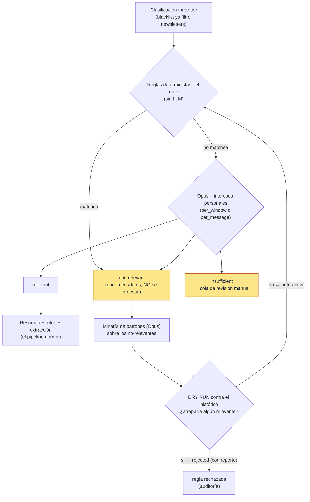

# Módulo de relevancia — arquitectura

El **portero del pipeline de correos**: antes de gastar LLM en resumir o extraer, un modelo
superior (Opus) decide si cada correo **vale la pena para el archivo personal**, consultando los
**intereses personales** del dueño. No relevante = no se procesa (el correo queda íntegro en
/datos); duda = cola de revisión manual. **No borra nada, nunca.**

Su motivación, en una frase: el router de extracción descartaba promos «porque son publicidad»
con varianza entre corridas (experimento 2026-06-12: 3 de 8 wishlists idénticos de Steam pasaron)
— pero hay publicidad que al dueño **SÍ** le importa. Los intereses son la lista de rescate.

La analogía: un asistente que abre tu correo cada mañana sabiendo qué te importa, tira los
panfletos, te deja lo importante sobre el escritorio y pone en una bandeja aparte lo que no sabe
dónde va — y además **aprende**: cuando ve que siempre tira lo del mismo remitente, escribe una
regla para que ni llegue al escritorio.

## Arquitectura

**De un vistazo:** las reglas deterministas (que el propio sistema minó y validó) filtran gratis;
lo que ninguna regla cubre lo juzga Opus contra los intereses. El ciclo de automejora es cerrado
y seguro: toda regla propuesta —por el LLM o a mano— pasa un **dry run determinista contra TODO
el histórico**; si atraparía un solo correo de relevancia efectiva TRUE, queda `rejected` con su
reporte persistido. Si pasa, se auto-activa, auditada y reversible.

La minería trabaja sobre el **acumulado**, no reacciona a correos sueltos: solo los remitentes
con `mining_min_messages`+ no-relevantes (setting del gate, default 5) entran al análisis — si
ninguno llega al umbral, la corrida es no-op **sin llamada LLM**. Los correos ya cubiertos por
una regla (`method='rule'`) no cuentan: esa clase está resuelta y no se vuelve a chequear con
LLM (el gate solo les estampa el veredicto con una comparación de strings, la auditoría de qué
regla los filtró).

## Decisiones de diseño (y por qué)

- **Rompe «advisory nunca acciona» a propósito.** El sistema de calidad existente (juez LLM,
  candidatos) solo informa; este módulo SÍ acciona (bloquea procesamiento, crea reglas). Es una
  excepción explícita y acotada, con tres garantías: dry run obligatorio, auditoría persistida
  (reporte + proposed_by + modelo + timestamps) y reversibilidad (toggle, sin borrado).
- **Automejora acotada al gate, NO a la extracción.** ADR-015 excluyó automejora/autofiltro de
  los módulos de extracción; acá nace como módulo APARTE y PREVIO al pipeline. Los prompts de
  extracción y los `interest` de los módulos no se tocan.
- **Solo correos** (`SourceKind.EMAIL`: imap/outlook). Chat/social/calendar pasan sin gate.
- **`relevance_marks` gana siempre.** El override manual existente (0049) es la palabra del
  dueño: mark TRUE rescata un `not_relevant` del gate; mark FALSE bloquea un `relevant`.
  Resolver un `insufficient` escribe mark + veredicto (method='manual') en una tx.
- **Ausencia de veredicto = pendiente-de-gate.** Con el gate ENCENDIDO, un correo aún no juzgado
  no entra a los worksets de resumen/extracción (no hay carrera entre gate y procesamiento: la
  etapa `relevance` corre antes en la misma corrida). Con el gate APAGADO (default), los
  worksets no filtran nada: comportamiento previo intacto.
- **Bypass per-mensaje.** `summarize_inbox`/`extract_inbox` (click explícito en /datos/:id) NO
  filtran — paridad con blacklist, que ese camino también procesa a pedido.
- **Dos modos conmutables** (experimento del dueño): `per_window` (1 llamada por ventana,
  veredictos por mensaje — default) y `per_message` (1 llamada por correo). La columna
  `relevance_verdicts.mode` registra con qué modo se emitió cada veredicto para comparar.
- **Proveedor nuevo: Anthropic** (`memex.llm.anthropic`, httpx sin SDK, mismo Protocol
  `LLMClient`). `ANTHROPIC_API_KEY` por Doppler; pricing local `claude-opus-4-8`
  (0.50/5.00/25.00 USD por 1M); saldo agotado llega como 400 «credit balance» → `LLMQuotaError`.
  El gate NUNCA usa el cliente DeepSeek compartido del pipeline.

## Tablas (migración 0065)

| Tabla | Qué guarda |
|---|---|
| `personal_interests` | Intereses en texto libre (UNIQUE por user+texto, `enabled`). |
| `relevance_gate_rules` | Reglas deterministas (`sender_email`/`sender_domain`/`subject_contains`/`list_id`), status `active/disabled/rejected`, `proposed_by`, `dry_run_report` JSONB (auditoría), modelo. |
| `relevance_verdicts` | El cursor del gate: una fila por mensaje (UNIQUE inbox_id), `verdict`, `method` (`rule/llm/manual`), `rule_id`, `mode`. |
| `relevance_gate_settings` | Una fila por user: `enabled` (default **FALSE**), `mode`, `model`. Tabla propia (no `module_settings`: el gate no es un InterestModule). |

`work_item_failures.stage` ganó `'relevance'`: una ventana cuyo JSON nunca parsea va a
dead-letter a los 3 intentos, como summarize/extract.

## Dónde corre

- **Corridas de procesamiento**: etapa `relevance` en `STAGE_ORDER` (entre classify y
  summarize) → la heredan `/procesamiento` (de una y por ventanas), `memex-reprocess` y
  `POST /inbox/{id}/reprocess`. También al inicio de `run_combined` (`memex-process`).
- **Jobs del scheduler**: `relevance_gate` (PT1H) y `relevance_rules` (P1D), fuera de
  `enabled_jobs` por default.
- **CLI**: `memex-relevance run|mine|settings|interests|rules|review`. `--provider codex`
  (EXPERIMENTAL, solo pruebas host-side): juzga vía `codex exec` con la suscripción del
  dueño — sin métricas de tokens (llm_calls a costo 0), requiere `codex login`, los
  veredictos quedan con `model='codex/<m>'` para comparar proveedores.
- **API**: `/relevance/*` (settings, interests, rules + mine, review). La corrida del gate no se
  dispara por API propia: va por las corridas de procesamiento.
- **UI**: /filtros → «Intereses personales» (toggle + modo + CRUD) y «Reglas automáticas y
  revisión» (reglas con reporte de dry run expandible, minar, cola de revisión).

## Trazabilidad y costo

Sin `trace_nodes` (crear roots pisaría la traza de extracción): la traza de la decisión es el
veredicto persistido (`reason`, `rule_id`, `model`, `mode`) + la llm_call correlacionada.
`llm_calls.purpose`: `relevance_gate` (veredictos) y `relevance_rules` (minería), con
`source_id`, conteos por veredicto en metadata y `response_text` crudo.

## Qué NO hace (a propósito)

- No borra ni purga mensajes (el dueño lo definió: no hay «eliminar»).
- No toca el código del clasificador three-tier ni `sender_tier_overrides` (sus reglas son
  PROPIAS, en su tabla, con su dry run).
- No gatea chat/social ni los caminos per-mensaje explícitos.
- No corre solo: apagado por default; encenderlo es decisión del dueño
  (`memex-relevance settings set --enabled true` o el toggle en /filtros).
