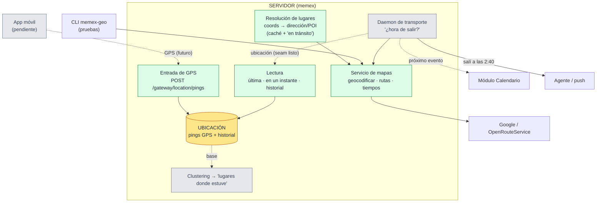

# Subsistema geo (ubicación)

> **Estado: parcialmente construido.** El **plano de ubicación** (entrada de GPS por el gateway +
> almacenamiento + lectura) y la **resolución de lugares** ya están **hechos** (commit `c7759df`,
> migraciones 0042/0043). Falta lo **reactivo**: el clustering de "lugares donde estuve", el daemon de
> transporte, la integración con el calendario, y la app móvil. Geo dejó de ser "solo un servicio de
> mapas".

**Geo NO es un módulo de extracción** como finanzas o calendario (esos sacan datos de los mensajes y
procesan por lotes). Es un **subsistema de ubicación**: tiene su propia entrada (el GPS del teléfono,
no el inbox), su propio almacenamiento, y —a futuro— un daemon que **colabora con el calendario** para
avisarte cuándo salir.

## Arquitectura (verde = hecho · gris = pendiente · amarillo = almacenamiento)

## Las piezas

- **App móvil** *(pendiente)* — mandará tu **GPS** al servidor. Hoy solo existe el **contrato del
  endpoint** (qué campos manda); la app en sí no está.
- **Entrada de GPS** *(hecho)* — `POST /gateway/location/pings`: la app pega al gateway y los pings se
  guardan tal cual (append-only), fuera del pipeline de mensajes. Más `GET /…/latest` para verificar.
- **Ubicación** *(hecho)* — guarda **todos los pings** (dónde estuviste y cuándo); de ahí salen "dónde
  estás ahora", "dónde estabas en tal instante" y el historial.
- **Lectura** *(hecho)* — una capa tipada que entrega la última ubicación, la de un instante dado, o
  el historial, a quien la necesite.
- **Resolución de lugares** *(hecho, no estaba en el diseño original)* — convierte coordenadas en una
  dirección o un negocio cercano, con **caché** (para no repetir llamadas a Maps) y **consciente del
  movimiento** (si vas rápido, te marca "en tránsito" sin gastar una llamada).
- **Servicio de mapas** *(hecho, ya existía)* — geocodificar direcciones y calcular distancias/rutas/tiempos.
- **Lugares donde estuve** *(pendiente)* — se derivarán **agrupando** los pings por permanencia
  (*clustering*). Hoy solo está la base (leer los pings de un rango); falta el algoritmo y su tabla.
- **Daemon de transporte** *(pendiente)* — mirará tu ubicación + tu próximo evento (del **calendario**)
  + el tiempo de viaje (del servicio) y disparará el aviso. El seam para leer tu ubicación **ya está
  enchufado**, pero nadie lo consume todavía.

## Decisiones tomadas

1. **El GPS entra por el gateway** ✅ — implementado: la app móvil manda los pings al gateway, igual
   que el cliente local manda records.
2. **"Estuve ahí" = clustering** ⏳ — agrupar los puntos GPS por permanencia (no solo los con nombre).
   Decidido; falta implementarlo.
3. **Cálculo determinista en memex, aviso lo decide el agente** — el "salí a las 2:40" es aritmética +
   rutas (sin IA) → lo computa memex; **el agente (Hermes) decide cómo y cuándo** notificarte.

## Por qué NO es un módulo

- **No extrae de mensajes** — su materia prima es el GPS, no el inbox.
- **Tiene entrada propia** — un flujo de ubicación por el gateway, no el pipeline de ingesta.
- **Será reactivo, no por lotes** — el daemon de transporte chequeará seguido (la utilidad es avisarte
  a tiempo); los daemons actuales (ingesta, procesamiento) corren por lotes cada tanto.
- **Es determinista** — Maps + aritmética, sin LLM.

## A tener presente

- **Ubicación fresca vs batería** — el daemon reactivo necesitará GPS reciente, así que depende de que
  la app mande ubicación con cierta frecuencia; hay un trade-off con la batería del teléfono.
- **Modo de transporte** — "cuándo salir" cambia según si vas en auto, a pie o en transporte público
  (el servicio ya distingue modos de viaje).
- **Retención de pings** — hoy `geo_location_pings` crece indefinidamente; falta una política de purga
  o agregación.

## Estado: qué está hecho y qué falta

**✅ Hecho (commit `c7759df`, migraciones 0042/0043):**
- Entrada de GPS por el gateway (`POST /gateway/location/pings`, append-only) + read-back (`GET /…/latest`).
- Almacenamiento de pings + historial (tabla `geo_location_pings`, multi-tenant).
- Capa de lectura tipada (`LocationReader`: última / en un instante / historial).
- **El seam enchufado**: `StoredLocationSource` lee tu último ping y lo da a `estimate_trip_from_source`
  **sin cambiar su firma** — tu ubicación real ya puede alimentar el "estimar viaje".
- Resolución de lugares (coords → dirección/POI) con caché global por celda (~11m) y `in_transit`.

**⏳ Falta:**
- **Clustering** de puntos → "lugares donde estuve" (solo está la base de leer pings por rango).
- **Daemon de transporte** (reactivo): leer ubicación + próximo evento del calendario, calcular el
  leave-by, y disparar el aviso vía el agente. No hay job en el scheduler.
- **Integración con el calendario** — el seam está tendido pero **sin consumidor** (calendar no llama
  a geo todavía).
- **App móvil** que capture el GPS y mande los pings.
- **Retención/purga** de los pings.

## Apéndice — piezas en el código

| Pieza | Rol |
|---|---|
| `api/routers/geo.py` | Gateway de ubicación: `POST /gateway/location/pings` (ingreso, append-only) + `GET /…/latest` (read-back). Registrado en `app.py`. |
| `geo/store.py` | Capa SQL pura: `insert_pings`, `latest_ping`, `ping_at`, `pings_in_range` ("base del clustering") + caché de lugares (`get/put_cached_place`). |
| `geo/domain.py` | `LocationReader` (latest/at/history) + **`StoredLocationSource`** (el seam con GPS real) + `resolve_place_at` (consciente del movimiento). |
| `geo/service.py` | Orquestación pura: `geocode_address`, `estimate_trip`, `estimate_trip_from_source` (seam con calendar), `reverse_geocode`, `nearby_place`, `resolve_place`. |
| `geo/client.py` | Contrato: `GeoProvider`, `GeoPoint`, `TravelEstimate`, `PlaceResult`, `ResolvedPlace` (`in_transit`), `LocationSource` (v0 `ManualLocationSource`). |
| `geo/google.py` · `geo/ors.py` | Proveedores: Google Maps (geocode + rutas + Places) y OpenRouteService (geocode + rutas; sin Places). |
| `geo/cli.py` (`memex-geo`) | CLI de pruebas: `geocode` / `trip` / `place`. |
| `migrations/0042_geo_location_pings.py` · `0043_geo_place_cache.py` | Tablas: `geo_location_pings` (por usuario, append-only) y `geo_place_cache` (global, por celda). |
