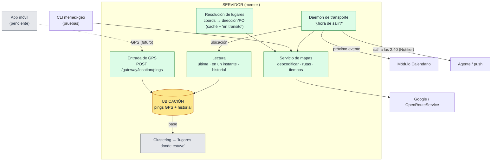

# Subsistema geo (ubicación)

> **Estado: parcialmente construido.** El **plano de ubicación** (entrada de GPS por el gateway +
> almacenamiento + lectura), la **resolución de lugares** (migraciones 0042/0043) y el **catálogo de
> lugares** con su integración al calendario (0047 + 0062) ya están **hechos**, igual que el **daemon
> de transporte** ("¿llego a tiempo?", reactivo, arranca apagado). Falta lo demás de lo **reactivo**:
> el clustering de "lugares donde estuve" y la app móvil. Geo dejó de ser "solo un servicio de mapas".

**Geo NO es un módulo de extracción** como finanzas o calendario (esos sacan datos de los mensajes y
procesan por lotes). Es un **subsistema de ubicación**: tiene su propia entrada (el GPS del teléfono,
no el inbox), su propio almacenamiento, y —a futuro— un daemon que **colabora con el calendario** para
avisarte cuándo salir.

## Arquitectura (verde = hecho · gris = pendiente · amarillo = almacenamiento)

## Las piezas

- **App móvil** *(pendiente)* — mandará tu **GPS** al servidor. Hoy solo existe el **contrato del
  endpoint** (qué campos manda); la app en sí no está.
- **Entrada de GPS** *(hecho)* — `POST /gateway/location/pings`: la app pega al gateway y los pings se
  guardan tal cual (append-only), fuera del pipeline de mensajes. Más `GET /…/latest` para verificar.
- **Ubicación** *(hecho)* — guarda **todos los pings** (dónde estuviste y cuándo); de ahí salen "dónde
  estás ahora", "dónde estabas en tal instante" y el historial.
- **Lectura** *(hecho)* — una capa tipada que entrega la última ubicación, la de un instante dado, o
  el historial, a quien la necesite.
- **Resolución de lugares** *(hecho, no estaba en el diseño original)* — convierte coordenadas en una
  dirección o un negocio cercano, con **caché** (para no repetir llamadas a Maps) y **consciente del
  movimiento** (si vas rápido, te marca "en tránsito" sin gastar una llamada).
- **Servicio de mapas** *(hecho, ya existía)* — geocodificar direcciones y calcular distancias/rutas/tiempos.
- **Lugares donde estuve** *(pendiente)* — se derivarán **agrupando** los pings por permanencia
  (*clustering*). Hoy solo está la base (leer los pings de un rango); falta el algoritmo y su tabla.
- **Daemon de transporte** *(hecho)* — cruza tu ubicación + tu próximo evento (del **calendario**) + el
  tiempo de viaje (del servicio) y, si hay que salir, emite el aviso por el seam **`Notifier`** (hoy un
  stub que loguea; el servicio real —vista en el dashboard— lo implementa otra sesión). Vive en
  `memex.transport` (job `transport` del scheduler, arranca **apagado**); además consulta on-demand por
  `GET /transport/next-arrival` y `memex-transport next-arrival`.

## Catálogo de lugares y resolución por texto (hecho, 0062)

El dueño lleva **registro de los lugares** donde está/estuvo. Jerarquía de confianza: el **ping GPS**
(cuando exista la app) es la **única fuente fiable** de posición real; un **evento de calendario con
lugar físico** = **posibilidad** de presencia; un **pago con lugar**, ídem. La inferencia de
presencia (cruzar ping↔evento/pago por ventana de tiempo) está **explícitamente diferida** a la app
móvil.

- **`geo_places`** — el catálogo canónico por usuario (single-writer: `geo/places.py`). La identidad
  fuerte la da el `provider_place_id`: dos grafías del mismo lugar ("Gabriel Giraldo S.J. 3-507" y
  "gabriel giraldo 3507") colapsan en **una** fila. `name` = cómo lo conoce el usuario (el **primer
  texto crudo** que lo resolvió; editable a futuro).
- **`geo_place_resolutions`** — caché texto→lugar **por usuario**: cada texto normalizado se resuelve
  **una sola vez** (mismo texto = 0 llamadas a Maps); un ZERO_RESULTS se cachea como `place_id NULL`
  y tampoco se reintenta. **No confundir** con `geo_place_cache` (caché **global por celda** de
  coordenada, para el reverse geocoding de pings): son direcciones opuestas.
- **Los dominios referencian a geo, no al revés** (patrón identidades): el calendario tiene
  `mod_calendar_consolidated.place_id` (FK al catálogo, 0062) y finanzas tiene
  `mod_finance_consolidated.place_id` (0063); geo no conoce dominios por nombre — la correlación
  rica la teje el grafo de relaciones. OJO: el `geo_place_id` TEXT que ya existía (0047) es el id
  del **proveedor** (denormalizado); el FK es `place_id` BIGINT.
- **Cómo se llena (calendario)**: al final de cada consolidación (gateado por
  `MEMEX_CALENDAR_GEOCODE=1`), cada `location` físico se resuelve contra el catálogo (los virtuales
  —links de Meet/URLs— se saltan). Borrar un lugar del catálogo deja los FK en NULL y la próxima
  consolidación lo **recrea** gastando una llamada: "borrar" no significa "no quiero este lugar".
- **Cómo se llena (finanzas)** — dos fuentes, en orden de confianza:
  1. **El seam GPS** (`memex-finance geo`, on-demand): el ping más cercano al instante del cobro se
     resuelve a POI (caché global por celda) y el lugar se **da de alta/colapsa** en el catálogo con
     `source='gps'` (la identidad sigue siendo el `provider_place_id` cuando el POI lo trae). El id
     queda en `metadata.geo.catalog_place_id` de la cruda y se propaga a la consolidada — directo si
     ya existe, o en la próxima consolidación (que lee el metadata, sin red). El GPS **pisa** una
     asociación manual previa al re-consolidar (es la fuente más fiable).
  2. **Asociación manual** (`memex finance set-place --id <consolidado>` con `--place-id`, `--text`
     o `--clear`): el camino del agente mientras no existe la app de pings ("este pago fue en X").
     `--text` reusa la resolución texto→catálogo (caché primero; el miss geocodifica).
  El **counterparty NUNCA se geocodifica** solo: "Rappi" o "Éxito" son cadenas, no lugares — geo
  opera sobre coordenadas/direcciones estructuradas; texto libre solo por pedido explícito.
- **Superficies**: `memex-geo places` (inventario + cuántos eventos **y pagos** referencian cada
  lugar), `memex calendario show` / `memex finance show` (lugar resuelto), `GET /calendar/events` y
  `GET /finance/transactions` (`place_name`/`place_address`), el inspector de eventos y la tabla de
  movimientos del dashboard.

## Decisiones tomadas

1. **El GPS entra por el gateway** ✅ — implementado: la app móvil manda los pings al gateway, igual
   que el cliente local manda records.
2. **"Estuve ahí" = clustering** ⏳ — agrupar los puntos GPS por permanencia (no solo los con nombre).
   Decidido; falta implementarlo.
3. **Cálculo determinista en memex, aviso lo decide el agente** — el "salí a las 2:40" es aritmética +
   rutas (sin IA) → lo computa memex; **el agente (Hermes) decide cómo y cuándo** notificarte.

## Por qué NO es un módulo

- **No extrae de mensajes** — su materia prima es el GPS, no el inbox.
- **Tiene entrada propia** — un flujo de ubicación por el gateway, no el pipeline de ingesta.
- **Será reactivo, no por lotes** — el daemon de transporte chequeará seguido (la utilidad es avisarte
  a tiempo); los daemons actuales (ingesta, procesamiento) corren por lotes cada tanto.
- **Es determinista** — Maps + aritmética, sin LLM.

## A tener presente

- **Ubicación fresca vs batería** — el daemon reactivo necesitará GPS reciente, así que depende de que
  la app mande ubicación con cierta frecuencia; hay un trade-off con la batería del teléfono.
- **Modo de transporte** — "cuándo salir" cambia según si vas en auto, a pie o en transporte público
  (el servicio ya distingue modos de viaje).
- **Retención de pings** — hoy `geo_location_pings` crece indefinidamente; falta una política de purga
  o agregación.

## Estado: qué está hecho y qué falta

**✅ Hecho (commit `c7759df`, migraciones 0042/0043):**
- Entrada de GPS por el gateway (`POST /gateway/location/pings`, append-only) + read-back (`GET /…/latest`).
- Almacenamiento de pings + historial (tabla `geo_location_pings`, multi-tenant).
- Capa de lectura tipada (`LocationReader`: última / en un instante / historial).
- **El seam enchufado**: `StoredLocationSource` lee tu último ping y lo da a `estimate_trip_from_source`
  **sin cambiar su firma** — tu ubicación real ya puede alimentar el "estimar viaje".
- Resolución de lugares (coords → dirección/POI) con caché global por celda (~11m) y `in_transit`.

**✅ Hecho además (0047 + 0062 + 0063):** el calendario SÍ llama a geo — su consolidación resuelve
cada `location` físico contra el **catálogo de lugares** (`geo_places`, FK `place_id` en el
consolidado) con dedupe por texto + colapso por `provider_place_id` (ver sección arriba). Y
**finanzas también**: FK `place_id` en `mod_finance_consolidated`, poblada por el seam GPS
(`memex-finance geo` → catálogo con `source='gps'` → propagación vía la consolidación) o a mano
(`memex finance set-place`).

**✅ Hecho además — daemon de transporte (`memex.transport`):** el consumidor reactivo de "¿llego a
tiempo?". Cruza próximo evento (calendar) + ubicación (`StoredLocationSource`) + tiempo de viaje y, si
hay que salir, emite por el seam **`Notifier`** (stub que loguea; el servicio real lo hace otra
sesión). Job `transport` del scheduler (**apagado** por default), consulta on-demand
`GET /transport/next-arrival` + `memex-transport next-arrival`, y emisor de prueba `memex-geo ping`.
Determinista, **sin migración** (stateless; la dedup la maneja el `Notifier` vía `dedup_key`).

**⏳ Falta:**
- **Clustering** de puntos → "lugares donde estuve" (solo está la base de leer pings por rango).
- **Inferencia de presencia** ping↔evento (diferida a la app móvil): el catálogo ya deja a ambos
  hablar el mismo idioma (lugares con coordenadas + eventos con FK + pings con coordenadas).
- **App móvil** que capture el GPS y mande los pings.
- **Retención/purga** de los pings.

## Apéndice — piezas en el código

| Pieza | Rol |
|---|---|
| `api/routers/geo.py` | Gateway de ubicación: `POST /gateway/location/pings` (ingreso, append-only) + `GET /…/latest` (read-back). Registrado en `app.py`. |
| `geo/store.py` | Capa SQL pura: `insert_pings`, `latest_ping`, `ping_at`, `pings_in_range` ("base del clustering") + caché de lugares (`get/put_cached_place`). |
| `geo/domain.py` | `LocationReader` (latest/at/history) + **`StoredLocationSource`** (el seam con GPS real) + `resolve_place_at` (consciente del movimiento). |
| `geo/service.py` | Orquestación pura: `geocode_address`, `estimate_trip`, `estimate_trip_from_source` (seam con calendar), `reverse_geocode`, `nearby_place`, `resolve_place`. |
| `geo/client.py` | Contrato: `GeoProvider`, `GeoPoint`, `TravelEstimate`, `PlaceResult`, `ResolvedPlace` (`in_transit`), `LocationSource` (v0 `ManualLocationSource`). |
| `geo/google.py` · `geo/ors.py` | Proveedores: Google Maps (geocode + rutas + Places) y OpenRouteService (geocode + rutas; sin Places). |
| `geo/places.py` | **Catálogo de lugares** (single-writer): `resolve_place` (texto→catálogo, resolve-or-create con caché), `upsert_place_from_poi` (POI ya resuelto → catálogo, p.ej. del seam GPS de finanzas), `get_place`, `list_places` (refs de calendario + finanzas). No confundir con `service.resolve_place` (coordenada→POI). |
| `geo/cli.py` (`memex-geo`) | CLI: `geocode` / `trip` / `place` (proveedor) + `places` (catálogo, solo DB) + `ping` (emisor de prueba: inyecta un ping, solo DB). |
| `transport/` (`memex-transport`) | **Daemon "¿llego a tiempo?"**: `reachability.py` (cálculo puro), `service.py` (orquesta calendar+geo+`Notifier`), `job.py` (`transport` en el scheduler, apagado), `cli.py`, `config.py`. |
| `api/routers/transport.py` | `GET /transport/next-arrival`: consulta on-demand del veredicto (no emite). |
| `notifications/` | Seam de avisos: `Notifier` Protocol + `Notification` (con `dedup_key`) + stub `LoggingNotifier` + `build_notifier`. El servicio real (persistencia + vista dashboard) lo implementa otra sesión. |
| `modules/finance/geo_places.py` | El seam GPS de finanzas (`memex-finance geo`): ping del instante del cobro → POI → alta en el catálogo (`source='gps'`) + `metadata.geo.catalog_place_id` + propagación a la consolidada. |
| `modules/finance/manual.py` | Operaciones manuales sobre el pago consolidado: `set_place` (asociación al catálogo) y `show_transaction` (detalle con lugar). CLI: `memex finance set-place` / `show`. |
| `migrations/0042_geo_location_pings.py` · `0043_geo_place_cache.py` | Tablas: `geo_location_pings` (por usuario, append-only) y `geo_place_cache` (global, por celda — reverse). |
| `migrations/0047_calendar_geo_coords.py` · `0062_geo_places.py` · `0063_finance_place.py` | Integración de dominios: coords denormalizadas en el consolidado de calendario (0047) + catálogo `geo_places`/`geo_place_resolutions` y FK `place_id` en calendario (0062) + FK `place_id` en finanzas (0063). |
