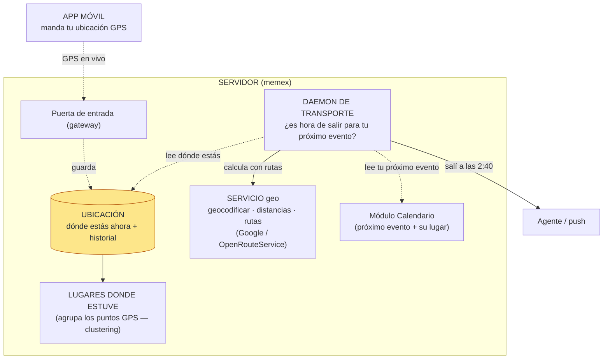

# Subsistema geo (ubicación) — diseño

> **Estado: diseño** (forward-looking). Hoy geo existe **solo como servicio** (geocodificar + rutas,
> Google/OpenRouteService) y **ningún módulo lo usa todavía**. Este doc describe el subsistema completo
> que se quiere construir. El servicio ya dejó el *seam* para engancharlo (ver Apéndice).

**Geo NO es un módulo de extracción** como finanzas o calendario (esos sacan datos de los mensajes y
procesan por lotes). Es un **subsistema de ubicación**: tiene su propia entrada (el GPS del teléfono,
no el inbox), su propio daemon, y una función que **colabora con el calendario** para avisarte cuándo
salir.

## Arquitectura

## Las piezas

- **App móvil** — manda tu **GPS** al servidor. Es una **entrada nueva** (un flujo continuo de
  "estoy acá ahora", distinto de los mensajes del inbox).
- **Puerta de entrada (gateway)** — la app pega al **mismo gateway** que usa el cliente local; los
  pings de ubicación entran por ahí.
- **Ubicación** — guarda dónde estás *ahora* + el **historial** de puntos.
- **Lugares donde estuve** — se derivan **agrupando** los puntos GPS por permanencia (*clustering*):
  cualquier sitio donde te quedaste un rato cuenta, no solo lugares con nombre. Es la fuente fuerte de
  presencia (mucho mejor que adivinarla de los mensajes).
- **Servicio geo** — lo que ya existe: geocodificar direcciones y calcular distancias/rutas/tiempos.
- **Daemon de transporte** — mira tu ubicación + tu próximo evento (del **calendario**) + el tiempo
  de viaje (del servicio) y, cuando toca, dispara el aviso.

## Decisiones tomadas

1. **El GPS entra por el gateway** — la app móvil manda los pings al gateway, igual que el cliente
   local manda records. Cada cierto tiempo (frecuencia a definir).
2. **"Estuve ahí" = clustering** — todo lugar donde te quedaste un rato (agrupando puntos GPS), no
   solo los geocodificados/con nombre.
3. **Cálculo determinista en memex, aviso lo decide el agente** — el "salí a las 2:40" es aritmética +
   rutas (sin IA) → lo computa memex; **el agente (Hermes) decide cómo y cuándo** notificarte.

## Por qué NO es un módulo

- **No extrae de mensajes** — su materia prima es el GPS, no el inbox.
- **Tiene entrada propia** — un flujo de ubicación por el gateway, no el pipeline de ingesta.
- **Es reactivo, no por lotes** — el daemon de transporte chequea seguido (la utilidad es avisarte a
  tiempo); los daemons actuales (ingesta, procesamiento) corren por lotes cada tanto.
- **Es determinista** — encaja con la filosofía de geo (Maps + aritmética, sin LLM).

## A tener presente

- **Ubicación fresca vs batería** — el daemon reactivo necesita GPS reciente, así que depende de que
  la app mande ubicación con cierta frecuencia; hay un trade-off con la batería del teléfono.
- **Modo de transporte** — "cuándo salir" cambia según si vas en auto, a pie o en transporte público
  (el servicio ya distingue modos de viaje).

## Estado actual y qué falta

**Hoy (en `src/memex/geo/`):** solo el **servicio** — geocodificar (`geocode_address`) y estimar
viajes (`estimate_trip` / `estimate_trip_from_source`) sobre proveedores Google / OpenRouteService.
El servicio ya dejó el enganche: `estimate_trip_from_source` toma una `LocationSource` (en v0 un punto
manual, `ManualLocationSource`) cuyo reemplazo futuro es **la geolocalización del teléfono, sin
cambiar la firma** — y está documentado como el seam con *"calendar reachability"*.

**Falta construir:**
- La **entrada de GPS por el gateway** (endpoint para los pings de la app móvil).
- El **almacenamiento** de ubicación actual + historial.
- El **clustering** de puntos → "lugares donde estuve".
- El **daemon de transporte** (reactivo): leer ubicación + próximo evento del calendario, calcular el
  leave-by con el servicio, y disparar el aviso vía el agente.
- La **app móvil** que manda el GPS.

## Apéndice — el seam que ya existe

| Pieza actual | Rol |
|---|---|
| `geo/service.py` | `geocode_address`, `estimate_trip`, `estimate_trip_from_source` (el seam con calendar). Orquestación pura, sin I/O propio. |
| `geo/client.py` | Tipos del contrato: `GeoProvider`, `GeoPoint`, `GeocodeResult`, `TravelEstimate`, `TravelMode`, y **`LocationSource`** (v0 `ManualLocationSource` → futuro: GPS del teléfono). |
| `geo/google.py` · `geo/ors.py` · `geo/providers.py` | Proveedores: Google Maps y OpenRouteService (routing). |
| `geo/cli.py` (`memex-geo`) | CLI de la utilidad. |

El reemplazo clave para este diseño: una `LocationSource` que lea la **última ubicación GPS** que la
app mandó por el gateway, en vez del punto manual de v0 — sin tocar `estimate_trip_from_source`.
